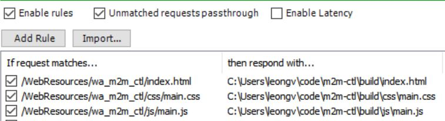

This project was bootstrapped with [Create React App](https://github.com/facebookincubator/create-react-app).

## Prerequisites

- [Node and NPM](https://nodejs.org/en/)
- [Fiddler](http://www.telerik.com/fiddler) (optional)

## Getting Started

This React app is meant to be embedded inside a Microsoft Dynamics CRM entity form. Due to non-trivial dependencies that are associated with being an embedded app, it is currently unable to run as a stand-alone. What that means is, when Webpack serves it on localhost, the app itself will run fine, but you'll see an error message in the notification area and will be unable to proceed any further, which is not very exciting.

The current development method relies on Fiddler, a program that can intercept outgoing requests and responds with local files that are on your machine. Using Fiddler, we can respond to Dynamics CRM requests for web resource by providing the files in this project's `build` folder. This assumes that you have initially uploaded a web resource and embedded it in an entity form, thus making Dynamics CRM to try and fetch that web resource.

1. Clone this repo - `git clone <ssh_or_https_url>`
2. Install packages - `npm i`
3. Make changes and build the project - `npm run build`
4. Download and install [Fiddler](https://www.telerik.com/download/fiddler)
5. Set Fiddler's AutoResponder to respond to requests for `/WebResources/wa_m2m_ctl/index.html` (assuming that's where you initially uploaded the web resource) with `/path/to/build/folder/index.html`.
6. Do the same thing for `main.css` and `main.js`.

Your Fiddler's AutoResponder should look something like this:

### Fiddler Tips

* *HTTPS* - Your Fiddler may not work correctly with HTTPS connections. There is a way to make it work if you look it up online.
* *Capturing* - To avoid too many noise, limit logging to as little sessions as possible and only capture browser traffic.

## Original `create-react-app` Template

Read it (here)[https://github.com/facebookincubator/create-react-app/blob/master/packages/react-scripts/template/README.md]
